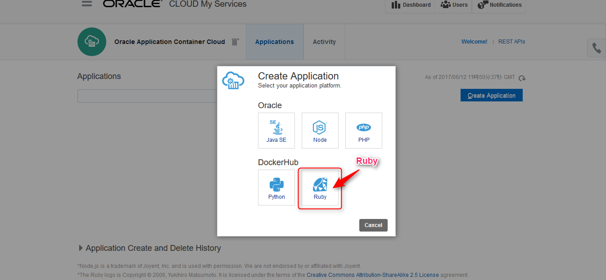
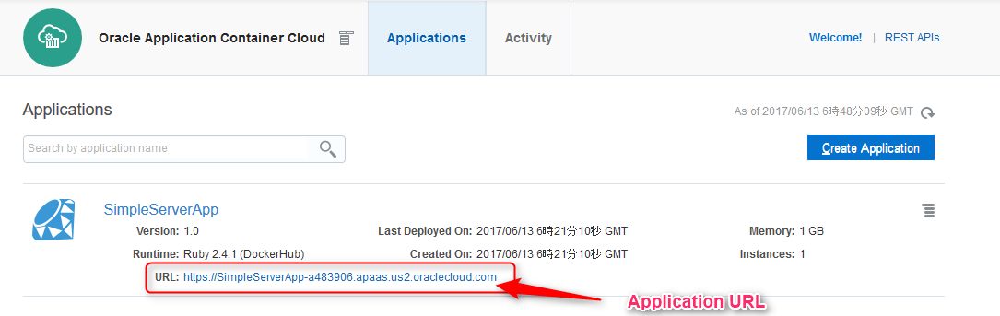

# Simple Ruby Application in Oracle Application Container Cloud Service

Oracle Application Container Cloud Service provides multiple language environments, which are based on Docker infrastructure.
This shows ruby Application runtime and simple http server application as example.

## Description

Oracle Application Container Cloud Service supports Ruby language and runtime. It provides two version as of ***June 2017*** :
- **2.3.4**
- **2.4.1**

## Demo


This demo application shows HTML file using TCPServer with ruby socket interface.

## Requirement

- should be installed Ruby over 2.4.1

## Usage

This application does not use gem though, you can use gem with Gemfile and Bundler. This project is configured with Bundler using `generate-project.sh`, which invoke the following command:

- `bundle install --path vendor/bundle --binstub`

All you have to do is archive this project files before you deploy it in Application Container Cloud Service.
You can modify `manifest.json` which describe application entry point depending on your customization.
You can use the shell `bin/archive.sh` when you archive this project.

## Installation

### 1. Create manifest.json

Describe application information in manifest.json at first. The following is the minimum information:

- runtime
- command (entry point)

```json
{
  "runtime": {
    "majorVersion": "2.4.1"
  },
  "command": "ruby lib/simple_server.rb"
}
```

### 2. Archive project

Next archive project and manifest.json into a zip file.

`bin/archive.sh`

### 3. Select Ruby in the Dashboard



### 4. Select an Archive file and Runtime version


### 5. Upload and Deploy


### 6. Access Application




## Licence

Released under the [MIT license](https://gist.githubusercontent.com/shinyay/56e54ee4c0e22db8211e05e70a63247e/raw/44f0f4de510b4f2b918fad3c91e0845104092bff/LICENSE)

## Author

[shinyay](https://github.com/shinyay)
