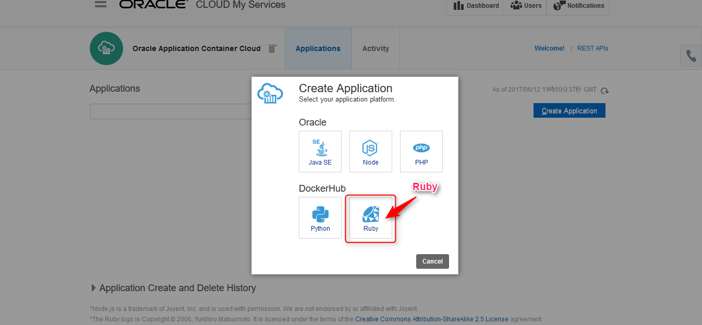
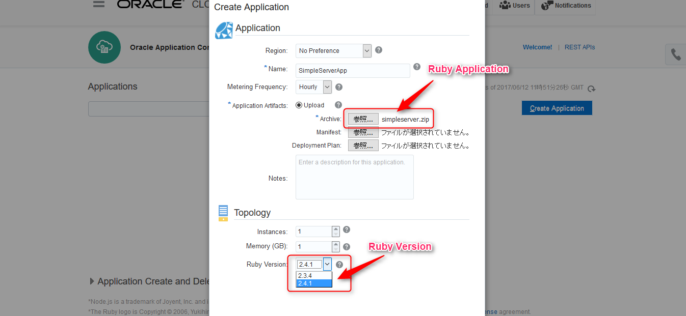
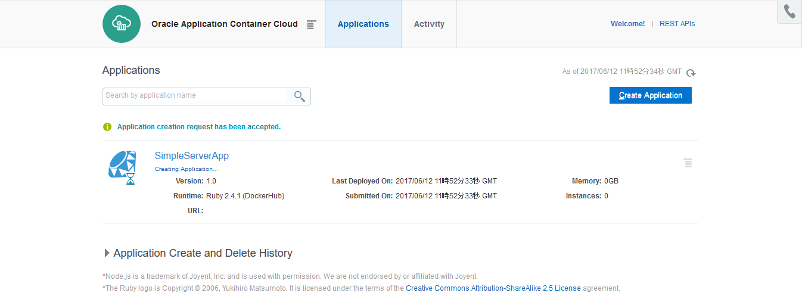
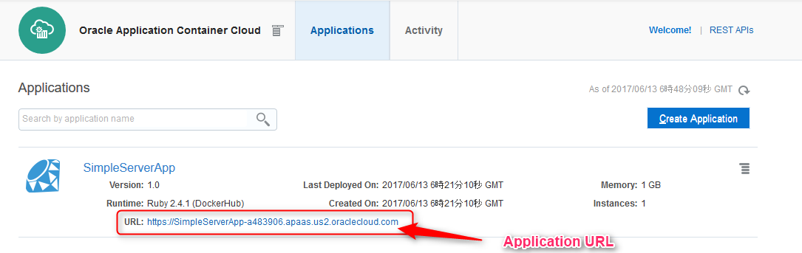
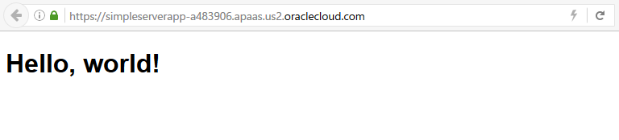

# Simple Ruby Application in Oracle Application Container Cloud Service


Oracle Application Container Cloud Service は、複数のプログラム言語のランタイム環境を提供するクラウドサービスですが、ここでは **Ruby** のアプリケーションを作ってデプロイしてみます。

## 説明

簡単なサンプルアプリケーションという事で、**socket** ライブラリを用いた Webサーバアプリケーションを作ってみます。

Socket ライブラリの TCPServer クラスを使うと簡単にサーバアプリケーションが作成できます。

- [TCPServerクラス](https://docs.ruby-lang.org/ja/latest/class/TCPServer.html)

ところで、Application Container Cloud Servcie が提供している Ruby のランタイムは、(2017年6月時点) 以下の２系統となっています:

- **2.3.4**
- **2.4.1**

今回は、2.4.1 を使用しています。

## デモ

以下は、サーバアプリケーションを Application Container Cloud Service にデプロイして動いているところの確認までの動作です。


## ソースコード説明

### Socket ライブラリのロード

```ruby
require "socket"
```

TCPServer を使用するので、socket ライブラリをロードしてます。

### サーバ接続のオープン

```ruby
PORT = ENV['PORT'] || 8080
server = TCPServer.open(PORT)
```

Application Container は公開するポートを動的に変更して、環境変数を用いて公開しているため、環境変数からポート番号を読み込んでいます。

### スレッド生成

```ruby
while true
  Thread.start(server.accept) do |socket|
```

マルチスレッドとして複数リクエストに対応しています。

### 接続相手先ソケットの情報出力

```ruby
    p socket.peeraddr
```

- 第一要素は、プロトコルの表示: AF_INET, AF_INET6 など
- 第二要素は、ポート番号
- 第三要素は、ホスト
- 第四要素は、IPアドレス

  - 例: `["AF_INET", 46102, "localhost.localdomain", "127.0.0.1"]`

### レスポンス出力

```ruby
request = socket.gets
p request

content = read_html
socket.write <<-EOF
HTTP/1.1 200 OK
Content-Type: text/html; charset=UTF-8
Server: rserver
Connection: close

#{content}
EOF

socket.close
```

レスポンスを出力します。`#{content}` は、以下の処理で外部に配置している HTML ファイルを読み込んだものを出力します:

```ruby
def read_html
	File.open(File.expand_path('../index.html', __FILE__)) do |f|
    f.read
  end
end
```

## デプロイ準備

Ruby アプリケーションも Application Container Cloud Service の作法に従い、manifest.json と 実行アプリケーションをアーカイブし、それをデプロイします。

`bin` ディレクトリ配下に アーカイブ用のシェルを用意しています。これを実行すると、`target` ディレクトリ配下にアーカイブが作成されます。

```
.
├── bin
│   └── archive.sh
├── lib
├── manifest.json
├── README.md
└── target
    └── oracle-accs-ruby-simple-server.zip
```

## デプロイ手順

### 1. manifest.json の作成

以下に最低限の情報を記載した manifest.json のサンプルを記載しています:

```json
{
  "runtime": {
    "majorVersion": "2.4.1"
  },
  "command": "ruby lib/simple_server.rb"
}
```

記載している内容は以下の２点です:
- ランタイムのバージョン
- 起動コマンド


### 2. アーカイブファイルの作成

以下のシェルを実行すると、`target` ディレクトリが作成され配下にアーカイブファイルが配置されます。

`bin/archive.sh`

### 3. Ruby アプリケーションの選択

Application Container Cloud Service のサービスコンソール画面から、**Ruby** を選択します:



### 4. アーカイブファイルとランタイム・バージョンの選択



manifest 及び deployment plan は選択不用です。

なお、アーカイブファイルに含まれる manifest.json にランタイム・バージョンを記載済みのため、デフォルトで指定したバージョンが選択されている状態になっています。

### 5. デプロイ



デプロイ完了まで少し待ちます。

### 6. 動作確認



表示されている URL にアクセスします。



起動している事が確認できました。

## Licence

Released under the [MIT license](https://gist.githubusercontent.com/shinyay/56e54ee4c0e22db8211e05e70a63247e/raw/44f0f4de510b4f2b918fad3c91e0845104092bff/LICENSE)

## Author

[shinyay](https://github.com/shinyay)
